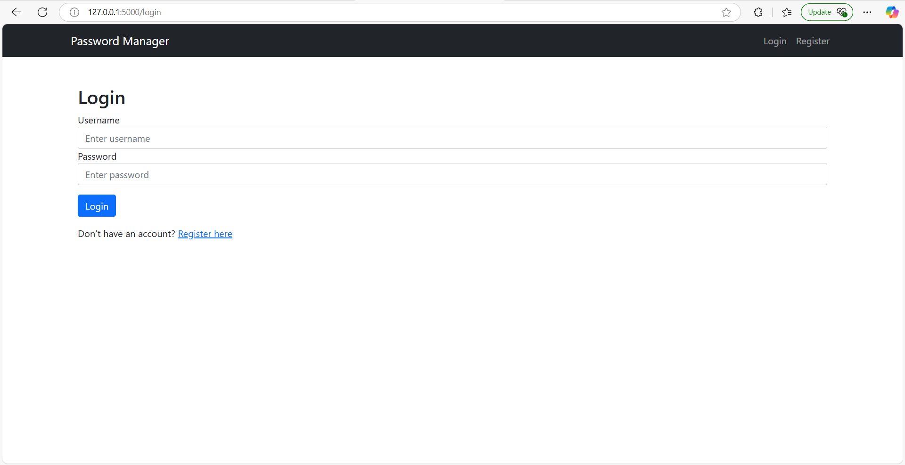

# Password Manager Web App (Flask, Bootstrap, SQLite)

A full-stack, secure password manager built using Flask and Bootstrap — the modern web evolution of my original [GUI-based password manager](https://github.com/Cyber-Security-Tech/password-manager-gui).  
This version brings multi-user support, encryption, password generation, and a responsive interface to the browser.

---

## 🌐 Live Demo

🔗 [View the deployed app on Render](https://password-manager-web-mh0f.onrender.com)

---

## 🎥 Demo Video

▶️ [Watch Demo Video on Google Drive](https://drive.google.com/file/d/1oyXyYrEpGUVASn18tGp9psi2mLyd0nML/view)

---

## 🚀 What’s New in the Web Version

- Full-stack Flask web architecture with backend and frontend separation  
- User registration & login with secure bcrypt hashing  
- Password vault with CRUD functionality (Add, Edit, Delete)  
- Encrypted password storage using `cryptography.fernet`  
- Clipboard copy buttons for quick password access  
- Built-in password generator  
- Live search across saved credentials  
- Responsive design using Bootstrap 5

---

## 🔐 Features Summary

| Feature                  | Description                                             |
|--------------------------|---------------------------------------------------------|
| Master Login             | Secure login/register with hashed passwords             |
| Password Vault           | Add, edit, delete, and view encrypted credentials       |
| Copy to Clipboard        | One-click password copy buttons                         |
| Live Search              | Instantly filter saved entries as you type              |
| Password Generator       | Auto-generate secure passwords                          |
| Encryption               | Stored passwords are encrypted using `cryptography`     |
| Responsive UI            | Bootstrap-based mobile-friendly layout                  |

---

## 🖼️ Screenshots

  
  
  
  


---

## ⚙️ How to Run Locally

```bash
git clone https://github.com/Cyber-Security-Tech/password-manager-web.git
cd password-manager-web

python -m venv venv
venv\Scripts\activate  # Windows
# or
source venv/bin/activate  # macOS/Linux

pip install -r requirements.txt

# Create the database
flask shell
>>> from app import db
>>> db.create_all()
>>> exit()

# Run the app
python run.py
```

---

## 🧪 Testing

This project includes a complete `test_app.py` script that simulates full user interaction using `pytest` and Flask's test client.

Covered functionality:
- User registration and login flows
- Adding new vault entries
- Validating flash messages and redirects
- Handling incorrect credentials and negative cases

---

## 🧠 What I Learned

- Structuring a Flask web application using Blueprints and factory pattern  
- Implementing secure login systems with hashed credentials  
- Encrypting sensitive fields using `cryptography.fernet`  
- Creating dynamic frontends with live search and responsive UI  
- Writing automated tests using pytest and Flask's test client

---

## 🧱 Tech Stack

- **Backend**: Flask, SQLAlchemy, Flask-Login, Flask-WTF, Flask-Bcrypt  
- **Frontend**: Bootstrap 5, Jinja2 Templates  
- **Encryption**: `cryptography.fernet`  
- **Database**: SQLite  
- **Testing**: pytest

---

## 💡 Future Improvements

- Email-based 2FA or MFA  
- Export/import vault entries (CSV or JSON)  
- User profile settings  
- Dark mode toggle  
- Auto-fill browser extension

---

## 📁 Project Structure

```
password-manager-web/
├── app/
│   ├── __init__.py
│   ├── models.py
│   ├── routes.py
│   ├── forms.py
│   ├── utils.py
│   └── templates/
│       ├── base.html
│       ├── login.html
│       ├── register.html
│       ├── dashboard.html
│       ├── edit_entry.html
├── static/
│   ├── demo/
│   │   └── demo.mp4
│   └── screenshots/
│       ├── login.png
│       ├── dashboard_add_password.png
│       ├── dashboard_saved_entries.png
│       ├── edit_vault_entry.png
│       └── search_vault_entries.png
├── run.py
├── test_app.py
├── requirements.txt
├── .env
├── .gitignore
└── README.md
```
