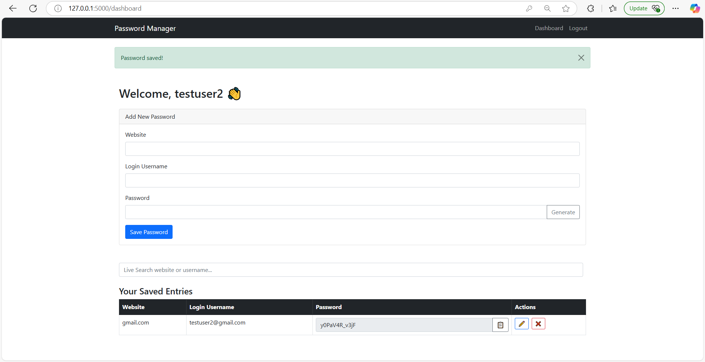
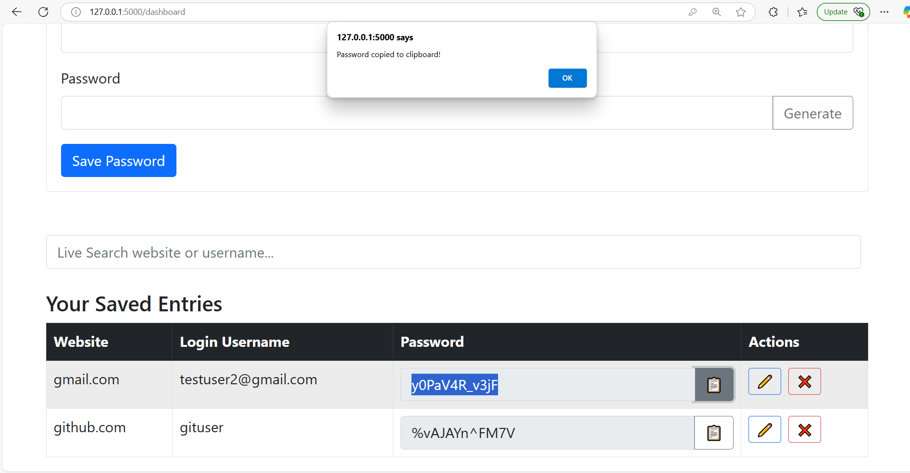
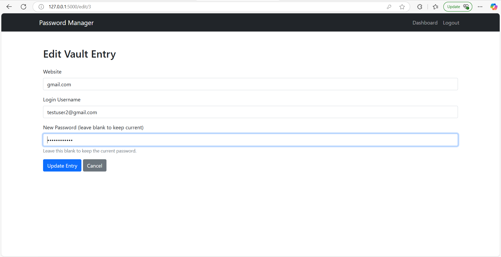
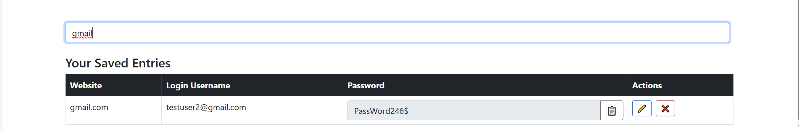

# 🔐 Password Manager Web App (Flask, Bootstrap, SQLite)

A full-stack, secure password manager built using Flask and Bootstrap — the modern web evolution of my original [GUI-based password manager](https://github.com/Cyber-Security-Tech/password-manager-gui).  
This web version brings sleek design, multi-user support, encryption, and responsive functionality to the browser.

---

## 🚀 What’s New in the Web Version

✅ **Full-stack Flask Web App** — Replaces the old GUI with a modern web interface  
✅ **User Registration & Login** — Secure, multi-user system with bcrypt password hashing  
✅ **Vault Dashboard** — Add, view, search, and edit saved credentials with ease  
✅ **Encrypted Passwords** — Vault entries are encrypted using Fernet symmetric encryption  
✅ **Clipboard Copy** — One-click password copy from the web interface  
✅ **Password Generator** — Generate strong random passwords instantly  
✅ **Live Search** — Filter your saved entries in real-time  
✅ **Responsive Design** — Built with Bootstrap 5 for mobile-friendly layout  
✅ **Flash Messages & Form Validation** — Clean user feedback and error handling

---

## 📸 Screenshots

![Login Screen]](static/screenshots/login.png)
*Login Page*


*Add Password Form*


*Saved Entries List*


*Editing Vault Entry*


*Search Vault Entries*

---

## 🧠 Features Summary

| Feature                  | Description                                             |
|--------------------------|---------------------------------------------------------|
| 🔐 Master Login          | Secure login/register with hashed passwords             |
| 🔑 Password Vault        | Add, edit, delete, and view encrypted credentials       |
| 📋 Copy to Clipboard     | One-click copy password buttons                         |
| 🔍 Live Search           | Instantly filter saved entries as you type              |
| 🛠 Password Generator     | Auto-generate secure passwords                          |
| 🧊 Encryption            | All stored passwords are encrypted using `cryptography` |
| 🖥️ Clean UI              | Bootstrap-based responsive and modern interface         |

---

## ⚙️ How to Run (Locally)

1. **Clone the repository**  
```bash
git clone https://github.com/Cyber-Security-Tech/password-manager-web.git
cd password-manager-web
```

2. **Set up a virtual environment**  
```bash
python -m venv venv
venv\Scriptsctivate   # On Windows
# or
source venv/bin/activate  # On macOS/Linux
```

3. **Install the dependencies**  
```bash
pip install -r requirements.txt
```

4. **Create the database**
```bash
flask shell
>>> from app import db
>>> db.create_all()
>>> exit()
```

5. **Run the app**  
```bash
python run.py
```

---

## 🗂️ File Structure Overview

```
password-manager-web/
├── app/
│   ├── __init__.py
│   ├── models.py
│   ├── routes.py
│   ├── forms.py
│   ├── utils.py
│   └── templates/
│       ├── base.html
│       ├── login.html
│       ├── register.html
│       ├── dashboard.html
│       ├── edit_entry.html
├── static/
│   ├── css/
│   └── js/
├── run.py
├── test_app.py
├── requirements.txt
└── README.md
```

---

## 📦 Tech Stack

- **Backend**: Flask, SQLAlchemy, Flask-Login, Flask-WTF, Bcrypt  
- **Frontend**: Bootstrap 5, Jinja2 Templates  
- **Encryption**: `cryptography.fernet` for secure password storage  
- **Database**: SQLite (local, easy to switch later)

---

## 🛠️ Still Want the GUI Version?

Check out the original version here:  
👉 [Password Manager GUI](https://github.com/Cyber-Security-Tech/password-manager-gui)

---

## 📄 License

MIT License  
© Nida Ilyas – 2025

---

## 🙌 Future Ideas

- Add email 2FA  
- Export/import credentials  
- Dark mode
